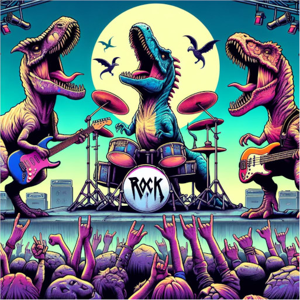

# Skynet



## Description

A game inspired by Chrome Dino.

## Usage

```python
print("ROARRRRRR!!!!!")
```

## Tech stack

<details><summary>Main programming language</summary>
<p

```python
print("It will be Python!")
```

</p>
</details>

<details><summary>Frameworks and libraries</summary>
<p

```python
print("We will find out as we go.")
```

</p>
</details>

## Authors

- 👦 Bartosz Karpiel
- 👩 Karolina Kaczmarczyk
- 👦 Bartłomiej Nałódka
- 👦 Piotr Skoczylas
